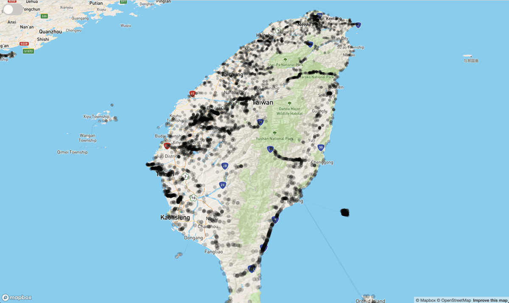

# A. Introduction

### a.1 ENV : next.js + mapbox

### a.2 Features

| I   | Features                                                                                        |
| --- | ----------------------------------------------------------------------------------------------- |
| 1   | Ｔ his is a map, in where the location about car-hitten accident of the wild life was displayed |
| 2   | In this web, user could have the view about these accidents in Taiwan in two modes.             |

### a.3 [DEMO](https://deathroad.vercel.app/)

# B. Getting Started

| I     | SOP                                                                                   |
| ----- | ------------------------------------------------------------------------------------- |
| dev   | `yarn` -> `yarn dev`                                                                  |
| build | `yarn build` & revise `.env`, changing `MAP_TOKEN` and `DOMAIN` to your server domain |

# C. structure

| path        | file's name   | usage                                                 |
| ----------- | ------------- | ----------------------------------------------------- |
| pages/api/  | deathroad.js  | fetching data from outer server                       |
| /           | fetcher.js    | calling from client to interior server                |
| pages/      | index.js      | basic layout and conditional rendering the components |
| components/ | Heatmap.js    | initialize the map                                    |
| components/ | Streetsmap.js | initialize the map                                    |
